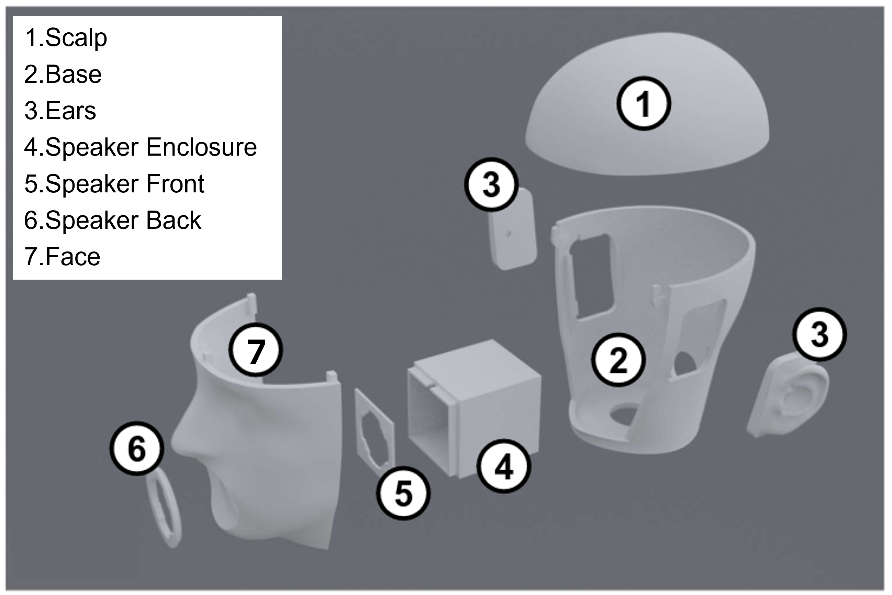

# 3D Printed Dummy Head

When equipped with microphones in the faux ear canals, this dummy head can record realistic binaural audio. Using a loudspeaker at the mouth position, it may also produce humanlike speech, with appropriate directivity.

The parts are interlocking so that the design is fully 3D printed. Small bolts can be used for stronger assembly, but this is optional.

## Sourcing the Parts

#### 🖨 3D Print Files

All printable components are provided as `.stl` files in the [`solids/`](./solids) directory:

| Links | Features | Approx. Print Time* | Approx. Filament Usage** |
| --- | --- | --- | --- |
| [Left Ear](./solids/ear_left.stl)   + [Right Ear](./solids/ear_right.stl) | Faux ear canals   Realistic shape for binaural recordings | 3 hours (per) | 7 m (per) |
| [Base](./solids/main_base_repair.stl)  + [Face](./solids/main_face.stl)  + [Scalp](./solids/main_scalp_repair.stl) | Realistic proportions and ear-to-ear distance   Port for microphone/loudspeaker cables | 18 hours (per) | 75±5 m (per)
| [Mouth Loudspeaker Enclosure](./solids/speaker_box.stl)  + [Front mounting plate](./solids/speaker_mount_front.stl)  + [Backplate](./solids/speaker_mount_back.stl) | Realistic talker directivity | 5 hours (total) | 25 m (total) |

*Based on a [Creality 3D Ender-5 Plus](https://www.creality.com/products/ender-5-plus-3d-printer) 3D Printer. The extra bed size of this printer is not actually necessary to print the head parts. We recommend using a [Bambu Lab X1 Carbon](https://us.store.bambulab.com/products/x1-carbon) for 3-4x faster print times.

**The full dummy head can be printed from a single [1 kg spool of 1.75mm PLA filament](https://www.hatchbox3d.com/collections/pla-1-75mm).

To print the parts:

1. **Open the `.stl` files** using a slicer program like [Bambu Studio](https://bambulab.com/en/software/studio) (we use this), [PrusaSlicer](https://www.prusa3d.com/prusaslicer/), or [Cura](https://ultimaker.com/software/ultimaker-cura).
   - Move the models so they don't intersect/overlap
   - Use the Auto-Orient tool to snap the models to the print bed, in an orientation that will reduce print time and support material usage
2. **Configure printer settings**.
   - Material: PLA (recommended)
   - Layer height: 0.2 mm (default)
   - Infill: 15% (default)
   - Supports: Type=normal(auto), Style=Snug
3. **Slice and export** the G-code.
   - The estimated print times and filament usage should roughly align with the above listed
4. **Print** the part using your 3D printer.

Need help getting started? Check out:
- [Beginner’s Guide to 3D Printing by All3DP](https://all3dp.com/2/how-to-3d-print-beginners-guide/)
- [Bambu Lab's Quick Start Guide](https://wiki.bambulab.com/en/x1/quick-start-guide)

#### 🔩 Purchased Parts
| Links | Qty | Features |
| --- | --- | --- |
| [Countryman B3 Omnidirectional Lavalier](https://countryman.com/product/b3-omnidirectional-lavalier/) | 2 | Omnidirectional   Wired, for synchronous multi-channel audio   Friction-fit between microphone cap and ear parts. |
| [Tectonic TEBM34C10-4 BMR 2" Full-Range Speaker](https://www.parts-express.com/Tectonic-TEBM35C10-4-BMR-2-Full-Range-Speaker-4-Ohm-297-216) | 1 | Human-like directivity ([compared to a studio monitor](https://pubs.aip.org/asa/jasa/article/148/4/2371/995223))   Flat frequency response |
| [Fosi Audio TB10D Amplifier](https://fosiaudio.com/pages/2-channel-amplifier-tb10d) | 1 | |
| [M2x12mm bolts](https://www.mcmaster.com/products/screws/thread-size~m2/length~12-mm/) for fastening the loudspeaker | 4 | |
| [M2 nuts](https://www.mcmaster.com/products/nuts/thread-size~m2/) for fastening the loudspeaker | 4 | |
| [M2x6mm bolts](https://www.mcmaster.com/products/screws/thread-size~m2/length~6-mm/) for fastening the ears/scalp (optional) | 4 | |

