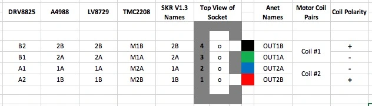

# Quiet Rotating Platform

This turntable locks onto the 3D printed head and rotates it quietly, enabling audio experiments with _repeatable_ source motion.

## ⚙ 1. Sourcing the parts

#### 🖨 3D Print Files

All printable components are provided as `.stl` files in the [`solids/`](./solids) directory:

| Links | Description |
| --- | --- |
| [Base Platform](./solids/base.stl) <br/> + [Motor Case](./solids/motorcase.stl) | The main stationary part of the turntable that encases the motor and homing induction sensor |
| [Grabber](./solids/grabber.stl) <br/> + [Plate](./solids/plate.stl) | The payload portion of the turntable that friction-fits with a dummy head and is rotated by the motor |

#### 🧾 PCB Fabrication Files

All files required for manufacturing the PCB can be found in [`gerber.zip`](./gerber.zip). This can be uploaded to a PCB manufacturer such as [PCBWay](https://www.pcbway.com/) and fabricated with low turnaround time and cost. Tutorials on using PCBWay are available on YouTube.

#### 🔩 Purchased Parts

The following parts need to be soldered to the PCB.

| Part | Qty | Designation on Schematic | Link                                                                 |
| --- | --- | --- | --- |
| Arduino Nano | 1 | None | [arduino](https://store.arduino.cc/products/arduino-nano) |
| TMC 2208 motor driver chip | 1 | None | [digikey](https://www.digikey.com/short/j84mhvfm)|
| Terminal Block for stepper motor | 1 | J2 (Screw_Terminal for motor) | [digikey](https://www.digikey.com/en/products/detail/phoenix-contact/1715747/260633) |
| Barrel Jack for power | 1 | J1 (Barrel_Jack) | [digikey](https://www.digikey.com/en/products/detail/same-sky-formerly-cui-devices/PJ-002A/96962)           |
| PinSocket headers for Arduino Nano | 2 | J3, J5 | [digikey](https://www.digikey.com/en/products/detail/sullins-connector-solutions/PPTC151LFBN-RC/810153)     |
| PinSocket headers for TMC 2208 driver chip | 2 | J4, J6 | [digikey](https://www.digikey.com/en/products/detail/w%C3%BCrth-elektronik/61300811821/17737805)            |
| Induction sensor terminal block | 1 | J7 | [digikey](https://www.digikey.com/en/products/detail/phoenix-contact/1715734/260632) |
| Adafruit adjustable power supply  (Run it at 18 Volts) | 1 | None | [digikey](https://www.digikey.com/short/31r0mw15)  |
| Induction sensor | 1 | None | [amazon](https://www.amazon.com/Taiss-NO%EF%BC%88Normally-LJ12A3-4-Z-inductive-Proximity/dp/B073XD44CW) |

The following components are used in/on the 3D printed parts.

| Part | Qty | Link                                                                 |
| --- | --- | --- |
| Small-size Stepper Motor | 1 | [digikey](https://www.digikey.com/en/products/detail/adafruit-industries-llc/324/5022791)|
| Flanged ball bearing | 1 | [mcmaster](https://www.mcmaster.com/57155K573/) |
| M3x20mm screws | 5 | [mcmaster](https://www.mcmaster.com/91292A123/) |
| M3x8mm screws | 20 | [mcmaster](https://www.mcmaster.com/91292A112/) |
| Variable power supply* | 1 | [digikey](https://www.digikey.com/en/products/detail/adafruit-industries-llc/5130/15277535) |

*We set the voltage to 20V.

## 🔧 2. Assembly Instructions

Follow the designators on this PCB to solder the parts above. Alternatively, consult the [schematic](./imgs/pcb_v2_schematic.png)

<div style="text-align:center">

</div>

Final assembled PCB:

<div style="text-align:center">

</div>

The PCB can be connected to the motor as follows:
<div style="text-align:center">

</div>

Follow [this](https://github.com/teemuatlut/TMC2208Stepper?tab=readme-ov-file) github tutorial to solder a UART bridge on the TMC motor driver.

Final assembled robot with dummy head:

<div style="text-align:center">

</div>

## 💾 3. Software

Once the PCB, 3D printed turntable, and 

#### 1. Setup host PC

Clone the repository
```bash
git clone https://github.com/Audio-Illinois/robot-acoustic-head.git
cd robot-acoustic-head/robot-mount
```
Onto a PC with either ALSA (Linux) or ASIO (Windows) audio drivers. Preferably, have Python 3.8.10 installed.

Install the necessary libraries
```bash
python3 -m pip install -r ./requirements.txt
```

#### 2. Flash Arduino

Install [`arduino-cli`](https://docs.arduino.cc/arduino-cli/installation/) for convenient Arduino flashing. Then, run:
```bash
cd scripts
python3 ./upload.py -P $PORT
```
> 💡 On an Ubuntu machine, you likely should set `PORT=/dev/ttyUSB0`. On Windows, try `PORT=COM4`.

Errors are expected when first calling this script - just follow the suggestions provided.

This is optional and you can instead use the [Arduino IDE](https://www.arduino.cc/en/software/), which will also make identifying the relevant serial port easier.

In either case, ensure that the [TMC2208Stepper](https://docs.arduino.cc/libraries/tmc2208stepper/) library is installed via Package Manager.

#### 3. Control the robot through console commands

Run 
```bash
python3 ./teleop.py $PORT
```

Example commands are `home`, which can be used to check that the homing induction sensor is wired properly, and `move <degrees>`/`move <degrees> <revs/s>` which is used to check that the motor calibration is correct. 

> 💡 It is advised to clamp the robot turntable onto a desk or other heavy platform.
